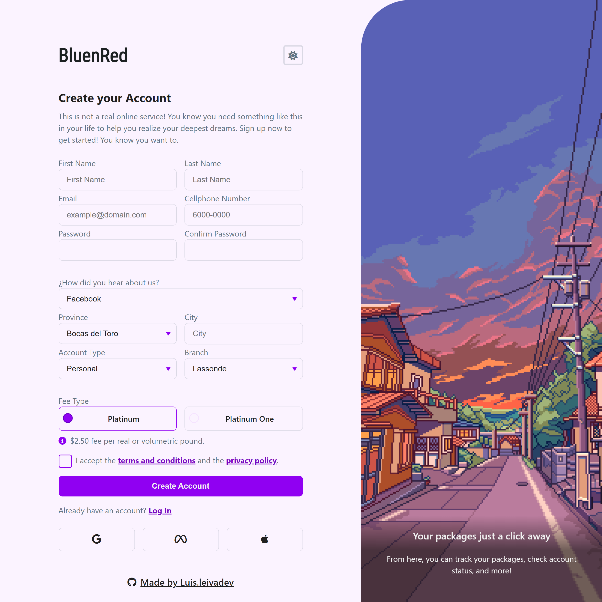

# Sign-up & Login Form - BluenRed

## [Try the demo!](https://leivadev.github.io/sign-up-form-bluenred/)

## 📃 About the project

Hey there!👋🏼 This is a sign-up & login form project taking inspiration from [RednBlue sign-up](https://portal.rednbluepty.com/registrate) and encouraged by [The Odin Project](https://www.theodinproject.com/lessons/node-path-intermediate-html-and-css-sign-up-form).

## 🔧 Built with

- HTML
- CSS
- JavaScript
- Font Awesome

## 📖 What I learned

- Understanding the fundamental elements of form design and validations.
- Responsive Design using the Mobile-First Design.
- Dark & light theme switcher.
- Basics of UI/UX Design.

## License

    Distributed under the MIT License.

## Author

### Luis Leiva - Software Developer from Panama

